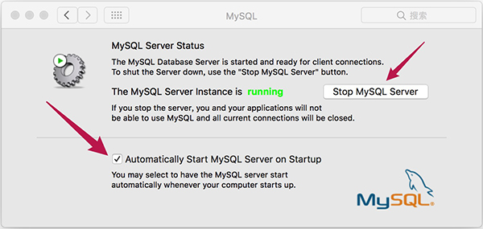

Mac平台下安装与配置MySQL
===

## Mac 安装MySQL

官网[下载安装包](http://downloads.mysql.com/archives/community/)，选择相应的版本和格式，有 .dmg 和 tar压缩包两种。我选择了 Mac OS X 10.11 (x86, 64-bit), DMG Archive 的版本下载，目前网站下载需要你注册登录，这个完全免费注册登录进去，就可以下载了。

DMG 文件点开默认安装完成之后(新版需要重启操作系统)，就可以在系统偏好设置里面看到 MySQL 的偏好设置面板。



## Mac 卸载MySQL

通过下面命令删除干净MySQL，同时在进入 **系统偏好设置** 里面删除 MySQL 的图标的设置项，点击右键会弹出 **移除MySQL偏好设置面板**

```bash
sudo rm -rf /usr/local/mysql*
sudo rm -rf /Library/StartupItems/MySQLCOM
sudo rm -rf /Library/PreferencePanes/My*
sudo rm -rf /Library/Receipts/mysql*
sudo rm -rf /Library/Receipts/MySQL*
sudo rm -rf /var/db/receipts/com.mysql.*
vi /Library/Receipts/InstallHistory.plist # 进入搜素 mysql , “shif+:” 输入mysql

find / -name mysql -print 2> /dev/null
sudo find / | grep -i mysql
```

## mysql命令不存在

有一个设置开机启动的勾选配置和一个服务启动和停止的按钮，管理MySQL服务。在命令行中就可以使用 MySQL 命令，新版 MySQL 如果没有mysql命令，提示 **-bash: mysql: command not found** 命令没有找到，你需要检测服务是否启动。

```bash
$ mysql -uroot -p
-bash: mysql: command not found
```

两种方式可以查看到服务是否启动，进入 **系统偏好设置** 查看服务运行状态。也可通过命令 **ps -ef | grep mysql** 查看服务是否启动，如果有多条记录输出到命令行面板，说明服务启动了。在服务启动中，MySQL 命令找不到，需要配置环境变量。

编辑 `.bash_profile` ，如果你命令行安装了 oh-my-zsh 命令行工具，你需配置 `.zshrc` 。

```bash
sudo vim ~/.bash_profile
```

在 .bash_profile 文件中添加下面文本

```bash
export PATH=${PATH}:/usr/local/mysql/bin 
```

让 .bash_profile 配置文件立即生效：

```bash
source ~/.bash_profile
```